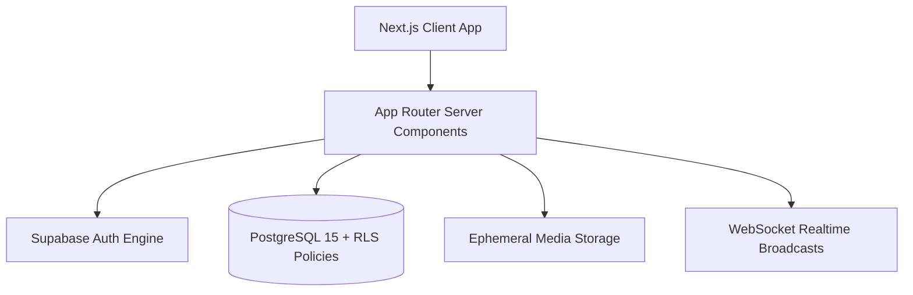

# CEOWEB 👑

> **Lead your network, build your legacy, master the loop.**
> A full-stack, gamified social network that combines the ephemeral excitement of Snapchat, the structured wall profiles of VK, and executive belt rank progression mechanics.

[](https://github.com/example/ceoweb/actions)
[](LICENSE)

---

## 🌟 Overview & Differentiators

CEOWEB was engineered as a portfolio project showcasing modern full-stack web engineering, resilient system architecture, and thoughtful product design:

1. **Belt Ranks Progression (Gamification)**:
   - Users earn XP for posting (+25), commenting (+10), keeping streaks (+20), and winning story chain rounds (+150).
   - Dynamic Belt progression (White → Yellow → Orange → Green → Blue → Brown → Black Belt Grandmaster) rendered dynamically next to usernames and profiles.
2. **Story Chains (Collaborative Writing)**:
   - Community members propose the next line of a story.
   - Users vote on candidates each round; winning entries become canon chapters in a published episode.
3. **Weekly Challenges**:
   - Themed platform competitions (e.g., "Show Your Study & Desk Setup") with community upvoting and leaderboards.
4. **Dojo Focus Mode (Digital Wellbeing)**:
   - Built-in customizable timers (15/30/60 min) that mute incoming notifications and shield feeds for distraction-free deep work.
5. **Mood Feed**:
   - Filter news feed by mood tags (`chill`, `funny`, `creative`, `study`) rather than purely algorithmic engagement traps.
6. **Snapchat-Style Ephemeral Features**:
   - 24-hour disappearing stories with segmented progress bars.
   - One-time opening ephemeral snaps with flame streak counters.
7. **VK-Style Wall & Profiles**:
   - Customizable profiles with status lines, bio, personal wall feeds, and leadership communities.

---

## 🛠️ Tech Stack

- **Frontend**: Next.js 14 (App Router), TypeScript (strict mode), Tailwind CSS, Framer Motion
- **UI Components**: Radix UI / custom shadcn-styled tokens, Lucide Icons
- **Backend & Database**: Supabase PostgreSQL, Supabase Auth, Storage, Realtime (with dual-mode fallback)
- **Security**: Complete Row Level Security (RLS) policies on every table
- **Testing**: Vitest, React Testing Library
- **Continuous Integration**: GitHub Actions CI (lint, unit tests, production build)

---

## 🚀 Quickstart & Local Setup (Under 3 Minutes)

```bash
# 1. Clone the repository
git clone https://github.com/your-username/ceoweb.git
cd ceoweb

# 2. Install dependencies
npm install

# 3. Configure environment
cp .env.example .env.local

# 4. Start the development server
npm run dev
```

Open [http://localhost:3000](http://localhost:3000) to view CEOWEB in action. Use the built-in guest demo account or switch users seamlessly!

---

## 🧪 Testing

```bash
# Run unit & gamification algorithm tests
npm test

# Run build verification
npm run build
```

---

## 📐 Architecture Diagram



---

## 📜 Database Schema & Security
See our detailed architecture documentation:
- [DATABASE.md](docs/DATABASE.md) - Entity-Relationship diagram and indexing strategy.
- [SECURITY.md](docs/SECURITY.md) - Row Level Security (RLS) specifications and privacy policies.
- [DECISIONS.md](docs/DECISIONS.md) - Architectural decision records.

---

## 💡 What I Learned & Engineering Challenges
- **Ephemeral State Lifecycle**: Engineering 24-hour expiration queries with database timestamps alongside client-side countdown animations.
- **Strict Row Level Security**: Enforcing zero data leakage for 1-time view snaps where only the sender and designated recipient can access media payloads.
- **Gamification Balance**: Fine-tuning exponential XP thresholds to make belt promotions feel earned and satisfying without encouraging platform spam.

---

## 📄 License
This project is open source and available under the [MIT License](LICENSE).
