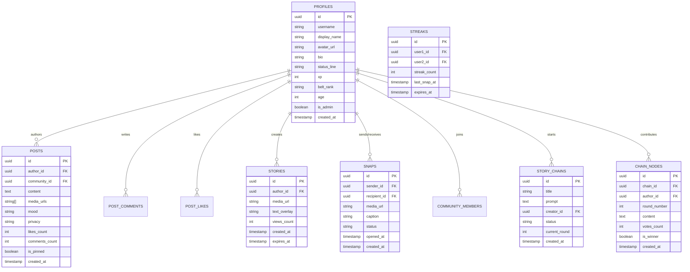

# NinjaLoop Database Architecture

## Entity-Relationship Diagram (Mermaid)

## Indexes for Query Acceleration
- `idx_posts_created_at`: `posts (created_at DESC)` for high-throughput feed queries.
- `idx_posts_mood`: `posts (mood)` for instant Mood Feed filtering.
- `idx_stories_expires_at`: `stories (expires_at)` for fast 24h expiration culling.
- `idx_chain_nodes_chain_round`: `chain_nodes (chain_id, round_number)` for efficient collaborative voting.
